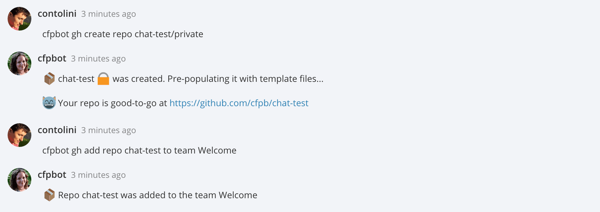

# hubot-github-management [](https://travis-ci.org/catops/hubot-github-management) [](https://www.npmjs.com/package/hubot-github-management)

:cat: A Hubot script for managing your GitHub organization's repositories and teams.

See [`src/github-management.coffee`](src/github-management.coffee) for full documentation.



## Installation

In hubot project repo, run:

`npm install hubot-github-management --save`

Then add **hubot-github-management** to your `external-scripts.json`:

```json
["hubot-github-management"]
```

## Configuration

```
HUBOT_GITHUB_ORG_TOKEN - (required) Github access token. See https://help.github.com/articles/creating-an-access-token-for-command-line-use/.
HUBOT_GITHUB_ORG_NAME - (required) Github organization name. The <org_name> in https://github.com/<org_name>/awesome-repo.
HUBOT_GITHUB_REPO_TEMPLATE - (optional) A git repo that will be used as a template for new repos. E.g. https://github.com/cfpb/open-source-project-template.git
HUBOT_GITHUB_REQUIRE_ADMIN - (optional) Set this to true to restrict create, delete and add commands to Hubot admins.
```

## Contributing

Please read our general [contributing guidelines](CONTRIBUTING.md).

## Open source licensing info
1. [TERMS](TERMS.md)
2. [LICENSE](LICENSE)
3. [CFPB Source Code Policy](https://github.com/cfpb/source-code-policy/)
